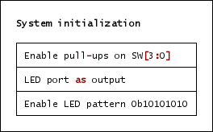
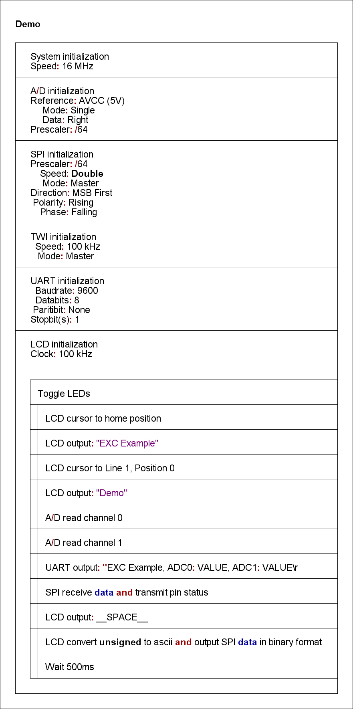

  

# `EXC` - EXtendable Controller (Erweiterbarer Mikrocontroller)

The `EXC` is a microcontroller board with an [ATmega16A](#additional-information)/[ATmega164A](#additional-information). The Board can be powerd over USB or from an external Source (`9-15V`) and used with common Voltages of `3V3` or `5V`. Over the USB port it is also possible to establish a serial (`uart`) connection to a computer. The Board itself offers a `SPI`, `I2C` interface for bus systems, a interface for connection to external interrupts of the microcontroller and a analog interface for reading analog data into the microcontroller. At `DP1` a [Display](#additional-information) can be connected to the board. The available demo firmware offers a quick demonstartion of the board functionallity. Check the [Software](#software) section to get more information.

| Experience | Level |
|:------------|:-----:|
| Soldering   |  |
| Software    |  |

# Downloads

| Type      | File               | Description              |
|:---------:|:------------------:|:-------------------------|
| Schematic | [pdf](https://github.com/0x007E/exc/releases/latest/download/schematic.pdf) / [cadlab](https://cadlab.io/project/28573/main/files) | Schematic files |
| Board | [pdf](https://github.com/0x007E/exc/releases/latest/download/pcb.pdf) / [cadlab](https://cadlab.io/project/28573/main/files) | Board file |
| Drill | [pdf](https://github.com/0x007E/exc/releases/latest/download/drill.pdf) | Drill file |
| Gerber | [zip](https://github.com/0x007E/exc/releases/latest/download/kicad.zip) / [tar](https://github.com/0x007E/exc/releases/latest/download/kicad.tar.gz) | Gerber/Drill files |
| Firmware | [zip](https://github.com/0x007E/exc/releases/latest/download/firmware.zip) / [tar](https://github.com/0x007E/exc/releases/latest/download/firmware.tar.gz) | Firmware for ATmega164A |

# Hardware

There are two parts of the hardware. The pcb and the housing of the `EXC`. The pcb is created with `KiCAD`. All files are built with `github actions` so that they are ready for a production environment.

## PCB

The circuit board is populated on one side. The best way for soldering is within a vapor phase soldering system.

### Top Layer

### Bottom Layer

# Configuration

With Jumper `J13` the `EXC` system is getting bus powered (`5V`). If the system runs with `5V` jumper `J12` has to be shorten between `2-3`. When the system is driven by an external source through the step-down converter the system voltage is switchable between `5V` and `3V3` over the slider switch `SW6`. If `3V3` are choosen the jumper `J12` should be shorten between `1-2`.

> Only change the state of `SW6` with disconnected power source. Also check if jumper `J12` is set correctly!

## LEDs/I2C

To enable the LEDs `LED0-1` jumper `J10` has to be shorten. If the `I2C` interface should be used the jumper `J10` has to be removed.

## UART

The UART of the `ATmega164A` can be coupled with the USB/UART bridge or with the external UART interface at connector `J5`. To set the transmission over USB/UART bridge jumper `J1` and `J2` should be shorten between `1-2`. For the external UART interface jumper `J1` and `J2` should be shorten between `2-3`.

## Display

The display can be powerd constantly over `J99` shorten between `2-3` or controllabe over the microcontroller pin `PA2` and `J99` shorten between `1-2`.

# Programming

The Firmware of the `EXC` can be programmed with [Microchip Studio](#additional-information) over ISP with an [ATMEL ICE](#additional-information) connected to `J9` of the `EXC`. It is necessary to power the board from outside either over USB or the external power supply during programming.

# Software

## Dataflow diagram

## Structogram

# Additional Information

| Type       | Link               | Description              |
|:----------:|:------------------:|:-------------------------|
| Display | [web](https://at.rs-online.com/web/p/lcd-displays-monochrom/5326385) | Display for extendable controller |
| Microchip Studio | [web](https://www.microchip.com/en-us/tools-resources/develop/microchip-studio) | Download Page for Microchip Studio
| Atmel ICE | [pdf](https://ww1.microchip.com/downloads/en/DeviceDoc/Atmel-ICE_UserGuide.pdf) | Atmel ICE Datasheet |
| ATmega16A | [pdf](https://ww1.microchip.com/downloads/en/devicedoc/atmel-8154-8-bit-avr-atmega16a_datasheet.pdf) | Microchip ATmega16A Datasheet
| ATmega164A | [pdf](https://ww1.microchip.com/downloads/en/devicedoc/atmel-8272-8-bit-avr-microcontroller-atmega164a_pa-324a_pa-644a_pa-1284_p_datasheet.pdf) | Microchip ATmega164A Datasheet |

---

R. GAECHTER
